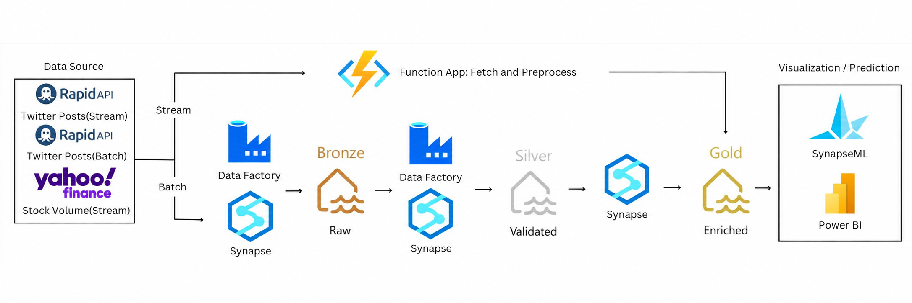

# From Tweets to Trends: Predicting Stock Prices Using X Sentiment

This project builds a fully automated, self-retraining pipeline that ingests tweets and stock data, engineers sentiment and engagement features, trains a volume-prediction model, and surfaces daily results through a Power BI dashboard — all orchestrated on Azure with a daily feedback loop.

## Course

* DS598 Big Data Engineering - Boston University 

## Team:

* Syeda Aqeel
* Yuchen Li
* Hsiang Yu Huang

## Overview

Social sentiment on X moves fast, and financial markets increasingly respond to it in real time. Rather than trying to predict the notoriously volatile stock price, this project predicts NVIDIA's next-day trading volume, a target that correlates more reliably with public sentiment and engagement metrics. Potential use cases include algorithmic trading signals, market risk monitoring, investor relations, and influencer/marketing analysis.

## Architecture

  

